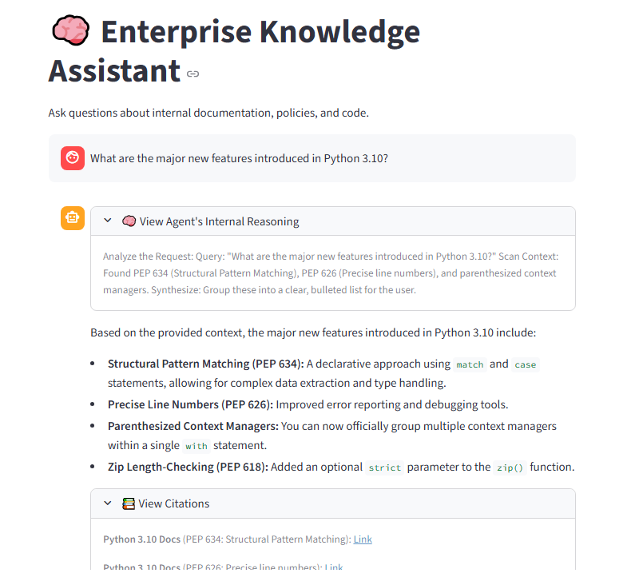

# 🧠 Enterprise Knowledge Assistant (Hybrid RAG)

A production-grade Retrieval-Augmented Generation (RAG) system built to provide hallucination-free, highly accurate answers from internal documentation. 

This project implements a two-stage hybrid retrieval pipeline (FAISS + BM25) with Cross-Encoder reranking, powered by a locally hosted, mathematically optimized Large Language Model (Qwen 3.5).

## System UI
 

### 1. Two-Stage Retrieval Pipeline
To solve the "semantic trap" of dense-only embeddings, this system uses a hybrid approach:
* **Stage 1 (Broad Search):** Combines **FAISS** (Dense vector search for semantic meaning) and **BM25** (Sparse search for exact keyword matching) using an Ensemble Retriever to cast a wide net (Top-K = 20).
* **Stage 2 (Precision Reranking):** Passes the retrieved documents through a **Cross-Encoder** (`ms-marco-MiniLM`) to strictly score and rerank the context pairs, sending only the most highly relevant chunks (Top-K = 8) to the LLM.

### 2. Optimized Inference Engine
* **Model:** Qwen 3.5 (4-Billion Parameters) deployed completely locally.
* **Quantization:** 4-bit NF4 quantization via `bitsandbytes` to fit within constrained GPU VRAM (NVIDIA T4).
* **Attention Optimization:** Utilizes PyTorch's native Scaled Dot Product Attention (SDPA) for memory-efficient, FlashAttention-like latency reductions without requiring custom C++ binaries.

## ✨ Key Features
* **Chain of Thought (CoT) Transparency:** Parses and displays the AI's internal reasoning process (`<think>` tags) in a collapsible UI element to build user trust.
* **Dynamic Citations:** Automatically extracts metadata (Document Source, Section Header, URL) from the retrieved chunks and displays clickable references.
* **Strict Guardrails:** System prompts and retrieval thresholds are strictly engineered to prevent hallucinations. If context is missing, the agent safely aborts and notifies the user.
* **Decoupled Deployment:** RESTful API architecture allows the backend engine to scale independently of the frontend UI.

## 💻 Tech Stack
* **Frontend:** Streamlit
* **Backend:** FastAPI, Uvicorn, Pydantic
* **LLM & Inference:** Hugging Face Transformers, PyTorch (SDPA), BitsAndBytes (4-bit quantization)
* **Retrieval & RAG:** LangChain, FAISS, BM25, SentenceTransformers (Cross-Encoder)
* **Data Ingestion:** BeautifulSoup, HTMLHeaderTextSplitter
ators
└── requirements.txt       # Python dependencies
